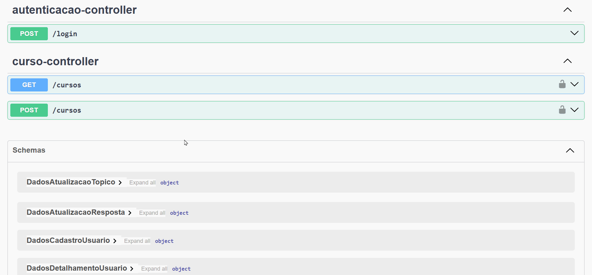
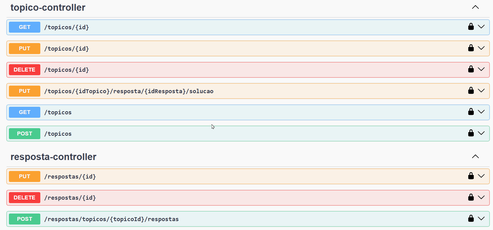
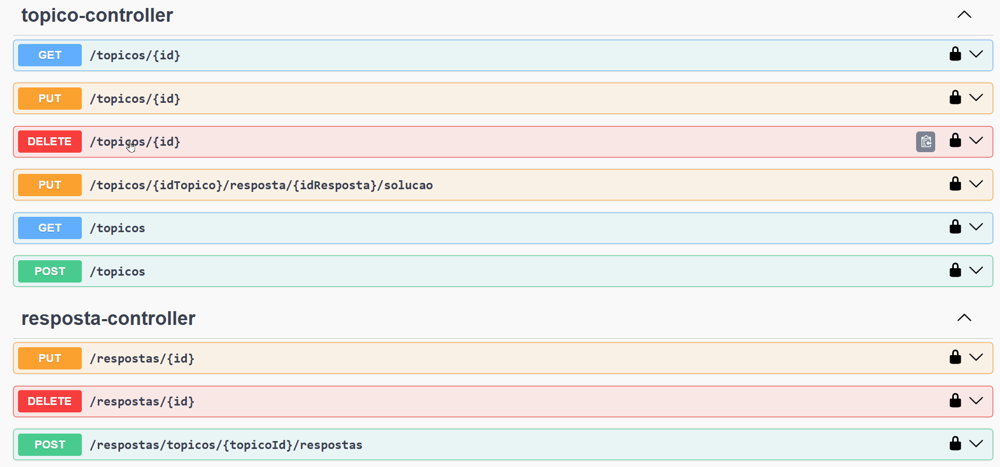
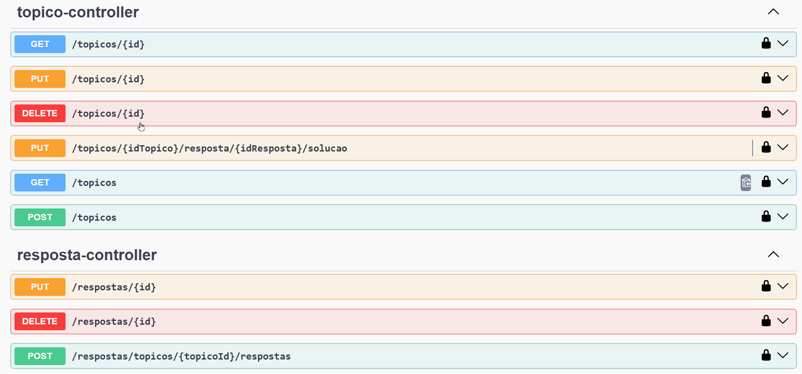

# 🎥 Swagger - Demonstrações Visuais

Este documento apresenta exemplos visuais da interface Swagger utilizada na API FórumHub.

---

## 🔐 Login via API com JWT — autenticação segura em ação

Gif mostrando requisição POST de login e recebendo token JWT.
---

## 📄 Consulta paginada de tópicos — resposta rápida e filtrada

Gif mostrando requisição GET com paginação e filtro no Swagger.

---

## 📝 Cadastro de novo tópico — API REST intuitiva e funcional

Gif mostrando requisição POST para criar um tópico.

---

## ✏️ Atualização de tópico — dados modificados via endpoint PATCH

Gif mostrando atualização parcial de tópico.

---

## ❌ Exclusão segura de tópico — controle de acesso aplicado

Gif mostrando requisição DELETE com autenticação.

---

## 💬 Listagem de respostas associadas — navegação organizada

Gif mostrando endpoint de listagem de respostas de um tópico.

---

## 📚 Documentação completa e interativa — Swagger UI facilitando testes

Gif geral navegando no Swagger UI, destacando endpoints e descrição.
